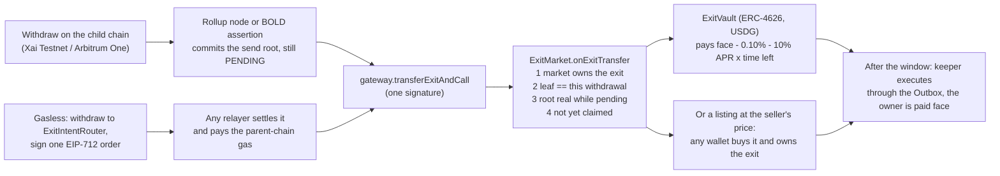

# Exit Market

[](https://github.com/Mohamed-Aaftaab/Exit-Market/actions/workflows/ci.yml)

**Sell an Arbitrum withdrawal while it is still waiting out its challenge period.** Exit Market proves on-chain,
against the rollup's own commitments, that a pending canonical-bridge withdrawal is real, and pays for it now,
using a hook every Arbitrum token gateway has shipped for years and nobody had used on mainnet.

Live on **Arbitrum Sepolia** with **Xai Testnet** (Orbit L3) as the child chain · BOLD verifier proven on an
**Arbitrum One mainnet fork** · proof core also in **Stylus** (Rust)

[Live app](https://exit-market-gamma.vercel.app) · [Desk](https://exit-market-gamma.vercel.app/app) ·
[Exit Explorer](https://exit-market-gamma.vercel.app/explorer) · [Pitch deck](https://exit-market-gamma.vercel.app/pitch) ·
[Source](https://github.com/Mohamed-Aaftaab/Exit-Market) · [Demo video (3 min)](https://youtu.be/h0rxSgWkFlg)

## Try it in two minutes

1. **Open the [Exit Explorer](https://exit-market-gamma.vercel.app/explorer).** No wallet needed: every token
   withdrawal ever made through Xai Testnet's standard gateway, read live from public RPCs, with the ones Exit
   Market bought marked.
2. **Open any transaction in [Live on testnet](#live-on-testnet--every-step-is-a-real-transaction)** below: a
   withdrawal, its sale while pending, a listing bought by another wallet, and the keeper settling each one.
3. **Use the [desk](https://exit-market-gamma.vercel.app/app)** with a browser wallet (MetaMask, Rabby). An empty
   wallet is fine: **Get test funds** sends 1.5 USDG and sXAI gas on Xai Testnet (once per address). Then start
   a **Fast exit** of at least 1 USDG (the vault's minimum): it needs no ETH on Arbitrum Sepolia, and the site's
   relayer settles it as soon as Xai's next node posts (~15 minutes). Selling to the vault yourself, listing at
   your price or buying a listing are one transaction each on Arbitrum Sepolia and need a little ETH there
   ([Alchemy faucet](https://www.alchemy.com/faucets/arbitrum-sepolia)). The scripts in
   [`scripts/demo/`](scripts/demo) run the same loop from a terminal with a funded test key. A keeper runs around the
   clock on GitHub Actions ([`keeper.yml`](.github/workflows/keeper.yml), a pass every 5 minutes): once an exit's
   challenge window ends it executes it, so the vault collects face value and its liquidity refills for the next seller.

**Testnet caveat.** Xai Testnet's challenge period is 150 L1 blocks (about 30 minutes), so the live demo and the
Explorer show minutes. Arbitrum One and mainnet Orbit chains use 45,818 blocks, about 6.4 days, which is the wait
Exit Market removes.

## The problem

Leaving Arbitrum through the canonical bridge (the only exit that needs no trust beyond the rollup) takes
**45,818 L1 blocks ≈ 6.4 days**. Once a withdrawal has started, nothing can speed it up.

| Arbitrum One → Ethereum (snapshot 2026-09-29) | |
|---|---|
| Token withdrawals in the last 30 days | **$51.0M** (760 exits) |
| Tokens sitting in the challenge window that day | **$10.2M** (177 exits), plus 24,675 ETH that bypasses the token gateway |
| Exits that finished the wait and were **never claimed** | **3,276 exits, $5.06M** ($1.92M of it in the last 12 months) |

Reproducible from chain data: [`research/stranded/`](research/stranded/README.md).

**Why it is still unsolved** ([comparison with sources](docs/pitch/COMPETITION.md)):

- **Fast bridges** (Across, CCTP, Stargate, Relay, Hop) are a route you must pick *before* withdrawing, with their
  own relayers, oracles or attesters. Across lists **none** of Xai, ApeChain, RARI, Sanko or EDU Chain.
- **Native Orbit fast withdrawals** shorten the window chain-wide through a validator committee the chain must
  opt into; per Arbitrum's docs such a chain "would technically no longer be a Rollup".
- **Nothing rescues a canonical withdrawal already in flight without a committee.** Exit Market does, per
  withdrawal, on the chain as deployed.

## The primitive nobody used

Every Arbitrum token gateway inherits `L1ArbitrumExtendedGateway.transferExitAndCall`: the owner of a pending
withdrawal can redirect it to a new address and call `onExitTransfer` on it. Its `WithdrawRedirected` event had
been emitted **zero times** on the Arbitrum One and Nova mainnet gateways
([reproduce](research/stranded/redirects.mjs)). The reason is in the source:

> "It is assumed the `_exitNum` is validated off-chain"

The gateway cannot tell a real withdrawal from a fake one, so nobody could safely buy one. Exit Market is the
missing on-chain validation. Prior art: Moosavi, Salehi, Goldman & Clark, *Fast and Furious Withdrawals from
Optimistic Rollups*, AFT 2023 ([doi:10.4230/LIPIcs.AFT.2023.22](https://drops.dagstuhl.de/entities/document/10.4230/LIPIcs.AFT.2023.22))
proposed tradeable exits on a modified Nitro; Exit Market runs on the bridge that is already deployed.

## How it works



All four checks run inside the seller's transaction, and again on every listing purchase:
`gateway.getExternalCall` (ownership), the Outbox item rebuilt byte for byte plus its Merkle path (`ExitLeaf.sol`),
the root against a pending legacy node's `confirmData` or a registered BOLD assertion, **with no rival node at any
level of its pending chain**, and `!Outbox.isSpent`.

## Trust model

- **Validity comes only from Arbitrum's own contracts**: the Outbox Merkle proof against a pending rollup node's
  committed send root, and the Outbox spent bitmap. No oracle, no committee.
- **No admin can move anyone's funds.** The live market has **no owner**: the v4 deployment allowed Xai Testnet's
  two gateways and then renounced ownership ([tx](https://sepolia.arbiscan.io/tx/0xa2d6cc472e56ce51b1d6e92f8b4e2af4d60b24a62df13df20d8e8e7ef6b1a8bb)),
  freezing its gateways, verifiers and 0.25% fee. The router has no owner. The vault's owner can only tune pricing
  inside hard caps (base fee ≤ 5%, APR ≤ 50%, exit size limits, accept pending exits on or off).
- **The buyer's risk is a rejected node, and a disputed one stops trading.** Buying before confirmation means
  trusting that the pending node the exit was proven against is not rejected; the vault prices that and writes such
  exits off. The moment any validator disputes the branch (a rival node at any pending level), the exit can no
  longer be sold or bought until the dispute resolves; what remains is a fraudulent node nobody disputes, which on
  chains with allowlisted validators (Xai Testnet is one) is the same trust the chain's own bridge places in them.
- **A buyer is only charged with its consent.** The vault returns `IExitBuyer.buyExit.selector` with its price;
  without that the market pulls nothing, so a wallet that merely approved the market cannot be named as a buyer.
- **The relayer cannot steal, and is optional.** The seller's signed order fixes the buyer and the minimum proceeds.
  Anyone can settle it, or reclaim the exit if nobody does: `node scripts/selfServe.ts settle <intent.json>` or
  `node scripts/selfServe.ts reclaim <withdrawalTx>`.

Full model, all findings and residual risks: [`docs/SECURITY.md`](docs/SECURITY.md).

## Live on testnet — every step is a real transaction

Current contracts (**v4**: rival-node check, buyer consent). Three exits, three ways out, each run to completion:

| Step | Transaction |
|---|---|
| Exit #14: 2.5 USDG withdrawn on Xai Testnet | [`0x15e38d3a…5488`](https://testnet-explorer-v2.xai-chain.net/tx/0x15e38d3a378ff54e899a24d5b50483fb34d5f66d5562894540f66e4c6d655488) |
| Sold to vault v4 while pending (node #61962, rival walk passed), one signature | [`0xa6eb8d37…bf55`](https://sepolia.arbiscan.io/tx/0xa6eb8d37170fa78f4d386a30a27f8779c08f2a90c9ffa53d138b53f6cce3bf55) |
| Exit #16: gasless, withdrawn to router v4 by a fresh wallet with **0 ETH** on Arbitrum Sepolia | [`0x3ecf9d6a…5b3b`](https://testnet-explorer-v2.xai-chain.net/tx/0x3ecf9d6a830a849ad661d1094df4a6f23d8a9205f18ba83bf231c46530675b3b) |
| Settled by the live site's relayer on Vercel; the seller received 2.47 USDG and still holds 0 ETH | [`0xdcabb327…2f57`](https://sepolia.arbiscan.io/tx/0xdcabb327855c2c00a6dad593f0cd7dd3af7a629ab1bd17f6708625b29d472f57) |
| Exit #15: 2 USDG withdrawn, then **listed at 1.99 USDG** in the desk | [`0x6cbac052…b28d`](https://testnet-explorer-v2.xai-chain.net/tx/0x6cbac0526486a8b052b65361d74a6ac43a5b077186f14ee8fda8803136d1b28d) · [`0x66d6e6c0…f772`](https://sepolia.arbiscan.io/tx/0x66d6e6c091374fc72f00df3501bc157551c8f16d27f53a43a60dbd430991f772) |
| **Bought by a second wallet** in the desk (exact approval, `buy` capped at the price; the market re-proved it) | [`0x6ff67081…7031`](https://sepolia.arbiscan.io/tx/0x6ff67081cdb80666962905f0414ffcdb4902df940b2e6ac54ec35c5bbcd77031) |
| After the window the permissionless keeper executed all three through the Outbox: the vault collected #14 and #16, the listing's buyer was paid 2 USDG for #15 | [#14](https://sepolia.arbiscan.io/tx/0xb3876fcbdf0aeec643235d04e5cb62fdc52bb76c5439c4bd99f0c5c84f36923b) · [collect](https://sepolia.arbiscan.io/tx/0x69afb2b235cf1e5a06ce1203b369e91678b4c6a29a97d69ce00987cefa0d8181) · [#16](https://sepolia.arbiscan.io/tx/0x049c328ed00c32512f5e1f2a8ade69cbceceba414c9e70bc3b606ee1533c0621) · [collect](https://sepolia.arbiscan.io/tx/0xb9156a72a846a4ccc402af0f53b70665ef5a7767a01f96002914cebe448c144e) · [#15](https://sepolia.arbiscan.io/tx/0xe779bc5e205c7c9cf033570247ec746acb20b7fc10490c155c491a0f7a02398f) |

Earlier contracts (v1 to v3), same flow, all executed and collected by the keeper:

| Step | Transaction |
|---|---|
| Exit #12 (v3): sold while pending; the market pulled the price from the vault | [`0x20ba5315…c782`](https://sepolia.arbiscan.io/tx/0x20ba5315574be5a0884a0c43cae52d798bcd22a3656a4a2440a218601c1dc782) |
| Exit #13 (v3): gasless from a 0-ETH wallet, settled by the relayer on Vercel | [`0x7a9d6168…658f`](https://sepolia.arbiscan.io/tx/0x7a9d6168e9bc171af415495716e600f50c91df6a0bd85e8bdcaf8ce3cfb1658f) |
| Exits #12 and #13 (v3): executed and collected by the keeper | [`0x4c7ef727…210b`](https://sepolia.arbiscan.io/tx/0x4c7ef727880843fc6a15c741fda4e5fff862b38a23e95c94eabf0426ef0a210b) · [`0xb9dee047…4c49`](https://sepolia.arbiscan.io/tx/0xb9dee04770a939b0779592e0a99192f84a017ea4d480c193c782b60f8bb84c49) · [`0x61a77afb…ba84`](https://sepolia.arbiscan.io/tx/0x61a77afb157fb6fa7e581c1b083bb7782612d4bb0a72db62375f948d8dadba84) · [`0x168967a6…2dc5`](https://sepolia.arbiscan.io/tx/0x168967a62050731e3740a2fe6f91fb4e1e8d5f1c0fda18763770054840d22dc5) |
| Exit #4: sold while pending (seller got 9.965 USDG) | [`0x1b724139…f430`](https://sepolia.arbiscan.io/tx/0x1b7241398b497ee83b045a6ee8e05256a3c7bae07884e75b9c02e6427db1f430) |
| Exit #5: gasless, from a wallet with **0 ETH** on Arbitrum Sepolia, settled by the app's relayer | [`0xd11f3260…719d`](https://sepolia.arbiscan.io/tx/0xd11f3260936bd5231a430cec999489f7da4b724a65a282c27e4500f7195e719d) |
| Exit #6 (v2): 10 USDG sold in the app while pending (seller got 9.96 USDG) | [`0xfc3a6c28…d87d`](https://sepolia.arbiscan.io/tx/0xfc3a6c284974612332fb8e1ff2667a52e9c6415c7e9d23a96f00e1c174a6d87d) |
| Exit #7 (v2): gasless through the router, settled by the app's relayer | [`0x06a3978b…b3eb`](https://sepolia.arbiscan.io/tx/0x06a3978b263d3f9743b3a2fb30fa81889b7732b3ea5d2ca668589975dca1b3eb) |
| Exit #11 (v2): gasless, settled by the relayer running on Vercel | [`0x1bc30a32…a57a`](https://sepolia.arbiscan.io/tx/0x1bc30a32312d2d1534233aa12fed7ae6e134fea619302138a3d3fd773743a57a) |
| Keeper executed an exit through the Outbox, vault collected face value | [`0xdf2df47a…f2ed`](https://sepolia.arbiscan.io/tx/0xdf2df47afe6a7dd8430d6269c5e30477bc9e17885fb7cae425935c238e66f2ed) · [`0x7d817f58…91f3`](https://sepolia.arbiscan.io/tx/0x7d817f5894c4a831c62e65c580c9a114107d9f5b3a5fc034191eb4745baf91f3) |

## Arbitrum technology used

| | |
|---|---|
| **Token bridge** | `transferExitAndCall` / `onExitTransfer` on the real parent gateways; sources derived on-chain (gateway → inbox → bridge → rollup → outbox) |
| **Outbox + NodeInterface** | leaf rebuilt byte for byte (`ExitLeaf.sol`), proofs from `NodeInterface.constructOutboxProof` against a *pending* node |
| **Legacy rollups** (Xai, most live Orbit L3s) | a pending node's `confirmData == keccak256(blockHash, sendRoot)` commits to its withdrawals; `LegacyRootVerifier` walks `prevNum` links to the latest confirmed node and refuses the root if any level has a rival child (from RollupCore's `latestChildNumber` / `firstChildBlock`). On the live rollup: 2 pending levels, 56k gas |
| **BOLD** (Arbitrum One/Nova, new Orbit chains) | `BoldRootVerifier` registers assertion preimages and walks every pending ancestor. The TypeScript library builds BOLD claims too (`scripts/lib/boldProof.ts`): on an Ethereum mainnet fork it proves a **real pending Arbitrum One withdrawal** under a **134-deep** real pending chain, and it is listed through the **real L1 gateway** (1.34M gas for the walk). The live testnet uses the legacy verifier because Xai Testnet is a pre-BOLD rollup |
| **Orbit L3** | live end to end on Xai Testnet → Arbitrum Sepolia |
| **Stylus** | the proof core in Rust/WASM, activated at [`0x30ac…1394`](https://sepolia.arbiscan.io/address/0x30ac015003186f187b9a11fff2781d55cc9e1394) and checked on-chain against a real Xai send root. It is a benchmark, not in the sale path, and not source-verified. Honest result: Solidity is cheaper at these depths (37.8k vs 69.0k gas at depth 7; 123.0k vs 131.7k at depth 64), [`docs/audit/STYLUS_BENCH.json`](docs/audit/STYLUS_BENCH.json) |
| **Arbitrum SDK** | `@arbitrum/sdk` registers Xai Testnet as a custom network and bridges USDG (`scripts/demo/bridgeSetup.ts`) |

## Security and quality

- **440 Solidity tests + 10 fork tests** against the real Xai and Arbitrum One contracts: unit, fuzz (including a
  brute-force model of random rollup node trees for the rival check), stateful invariants (market, router, vault)
  and exploit regressions. **99.42% line coverage** of the production contracts (513/516; the three misses are
  defensive reverts): [`docs/audit/COVERAGE.md`](docs/audit/COVERAGE.md).
- **Six internal review rounds** (AI-assisted, not a third-party audit). Every High or Critical finding was
  reproduced as an exploit test before its fix, including round 5's two Highs (a market balance-delta theft and the
  owner's ability to allow a hostile gateway). Round 6 closed the residual risks: the legacy verifier now refuses a
  contested node, and buyers must consent before they are charged. Redeployed as v4: [`docs/SECURITY.md`](docs/SECURITY.md).
- **Slither: no open finding.** Every detector that fires on the v4 sources, including two rated High, is triaged with its reason and test ([`docs/audit/SLITHER.md`](docs/audit/SLITHER.md)). Gas: [`docs/audit/GAS.md`](docs/audit/GAS.md).
- **Web hardening:** a Content-Security-Policy limited to the origins the site uses, frame and sniffing protection,
  rate-limited relayer and faucet APIs.
- **CI** on every push: contracts, generated-ABI drift check, typecheck, web unit tests, lint and a production build
  ([`.github/workflows/ci.yml`](.github/workflows/ci.yml)).

## Business model and first-month KPIs

Protocol revenue is the 0.25% market fee; the vault discount (≈0.27% for a full window) goes to LPs, ≈15.7% APR
gross at full utilisation. First 30 days on mainnet: ≥ 20 exits from ≥ 10 sellers and ≥ $100K face value;
≥ $50K vault TVL from ≥ 5 LPs at ≥ 40% utilisation with zero write-offs; ≥ 5% of eligible in-window face value
bought. Details and honest limits (price vs CCTP, ETH and gas-token exits): [`docs/pitch/COMPETITION.md`](docs/pitch/COMPETITION.md).

## Repository

| Path | What |
|---|---|
| `contracts/ExitMarket.sol` | hook verification, listings (list/buy/cancel/settle), one-transaction sale to any `IExitBuyer` (pull payment) |
| `contracts/ExitVault.sol` | ERC-4626 USDG vault: instant buyer, live NAV with accrued discount, rejected-node write-offs |
| `contracts/ExitIntentRouter.sol` | gasless sign-once exits, reclaim, recovery of executed exits |
| `contracts/verifiers/` | `LegacyRootVerifier` (node-based rollups) and `BoldRootVerifier` (BOLD) |
| `contracts/libraries/` | `ExitLeaf` (Outbox item + Merkle, byte for byte), `ExitAccrual`, `ExitKeys` |
| `scripts/lib/` | the TypeScript library the app and scripts share ([README](scripts/lib/README.md), entry `index.ts`): legacy and BOLD proof builders, hook encoding, listings, relayer, ABIs generated from the contracts |
| `scripts/` | deploy, permissionless keeper (executes every verified exit, collects for the vault, settles listings), demo flows |
| `stylus/exit-proof/` | the proof core in Rust (Stylus SDK 0.9) |
| `web/` | Next.js app: landing (`/`), desk with instant sale, gasless exits, listings, test funds and the vault (`/app`), live Exit Explorer (`/explorer`), pitch deck (`/pitch`), relayer and faucet APIs |
| `research/stranded/` | the mainnet stranded-exit, challenge-window and hook-usage research |
| `video/` | the demo video as code: Blender (Cycles) shots, live-app capture harness, cards, assembler |

## Run it

Needs Node.js 24 (see `.nvmrc`): the scripts and tests run TypeScript directly with Node's built-in type stripping.

```bash
npm install
npx hardhat test solidity                      # 440 tests
npm run test:fork                              # + 10 fork tests against Xai Testnet and Arbitrum One mainnet (*)
npm run test:lib && npm run test:web           # library and web unit tests
npm run typecheck                              # both TypeScript projects
npm run web:dev                                # http://localhost:3000, no configuration needed
node scripts/keeper.ts --loop                  # permissionless keeper (also scheduled: .github/workflows/keeper.yml)
node scripts/selfServe.ts settle <intent.json>  # be your own relayer (or: reclaim <withdrawalTx>)
```

(*) Public RPCs keep only recent Arbitrum Sepolia state, so the four Xai fork tests skip, with a message, once their
pinned block ages out of that window. `node scripts/dev/makeForkFixture.ts <withdrawal tx>` re-pins them to a live
pending node, or set `ARB_SEPOLIA_RPC_URL` to an archive node.

## Deployments (Arbitrum Sepolia, v4)

Addresses are also in [`deployments/arbitrumSepolia.json`](deployments/arbitrumSepolia.json), with v1 to v3 under
`history`. Every Solidity contract's source is verified on Sourcify (exact match); the address links open it on
Blockscout, which shows that verified source.

| Contract | Address (verified source) | Sourcify |
|---|---|---|
| ExitMarket (no owner) | [`0x199b327bbf8051c7ad74d434fbdea8f801ccb0f0`](https://arbitrum-sepolia.blockscout.com/address/0x199b327bbf8051c7ad74d434fbdea8f801ccb0f0?tab=contract) | [exact match](https://repo.sourcify.dev/421614/0x199b327bbf8051c7ad74d434fbdea8f801ccb0f0) |
| ExitVault (evUSDG) | [`0xbc42dd69e9bc4bf8ee32ddf9fe8c0dc9bb9e108c`](https://arbitrum-sepolia.blockscout.com/address/0xbc42dd69e9bc4bf8ee32ddf9fe8c0dc9bb9e108c?tab=contract) | [exact match](https://repo.sourcify.dev/421614/0xbc42dd69e9bc4bf8ee32ddf9fe8c0dc9bb9e108c) |
| ExitIntentRouter | [`0x0705322c2917c8dbad0e49e668b7ef8921903a4e`](https://arbitrum-sepolia.blockscout.com/address/0x0705322c2917c8dbad0e49e668b7ef8921903a4e?tab=contract) | [exact match](https://repo.sourcify.dev/421614/0x0705322c2917c8dbad0e49e668b7ef8921903a4e) |
| LegacyRootVerifier (rival check) | [`0x32c601710761500cd783187d5d60fb3d005b9375`](https://arbitrum-sepolia.blockscout.com/address/0x32c601710761500cd783187d5d60fb3d005b9375?tab=contract) | [exact match](https://repo.sourcify.dev/421614/0x32c601710761500cd783187d5d60fb3d005b9375) |
| BoldRootVerifier | [`0xa44d3b2dd5d3ac2990dd9d4fd848576f210fc903`](https://arbitrum-sepolia.blockscout.com/address/0xa44d3b2dd5d3ac2990dd9d4fd848576f210fc903?tab=contract) | [exact match](https://repo.sourcify.dev/421614/0xa44d3b2dd5d3ac2990dd9d4fd848576f210fc903) |
| Stylus ExitProof (benchmark) | [`0x30ac015003186f187b9a11fff2781d55cc9e1394`](https://arbitrum-sepolia.blockscout.com/address/0x30ac015003186f187b9a11fff2781d55cc9e1394) | not source-verified |
| Payment token (Paxos USDG) | `0xFFC95faa3d63Cde504a05B567C600B78C0b41892` | |

Allowed gateways (frozen): Xai Testnet standard `0xCcB451…1256` and custom `0x04e14E…5D88`.

Built for the Arbitrum Open House Singapore Online Buildathon. Payments in Paxos **USDG**.

## License

[MIT](LICENSE).
