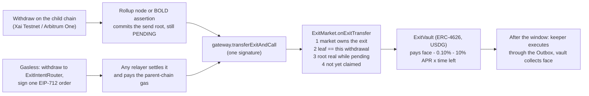

# Exit Market

[](https://github.com/Mohamed-Aaftaab/Exit-Market/actions/workflows/ci.yml)

**Sell an Arbitrum withdrawal while it is still waiting out its challenge period.** Exit Market proves on-chain,
against the rollup's own commitments, that a pending canonical-bridge withdrawal is real, and pays for it now,
using a hook every Arbitrum token gateway has shipped for years and nobody had used on mainnet.

Live on **Arbitrum Sepolia** with **Xai Testnet** (Orbit L3) as the child chain · BOLD verifier proven on an
**Arbitrum One mainnet fork** · proof core also in **Stylus** (Rust)

[Live app](https://exit-market-gamma.vercel.app) · [Desk](https://exit-market-gamma.vercel.app/app) ·
[Exit Explorer](https://exit-market-gamma.vercel.app/explorer) · [Pitch deck](https://exit-market-gamma.vercel.app/pitch) ·
[Source](https://github.com/Mohamed-Aaftaab/Exit-Market) · Demo video: link added at submission

## Try it in two minutes

1. **Open the [Exit Explorer](https://exit-market-gamma.vercel.app/explorer).** No wallet needed: every token
   withdrawal ever made through Xai Testnet's standard gateway, read live from public RPCs, with the ones Exit
   Market bought marked.
2. **Open any transaction in [Live on testnet](#live-on-testnet--every-step-is-a-real-transaction)** below: a
   withdrawal, its sale while pending, and the keeper collecting it after the window.
3. **Use the [desk](https://exit-market-gamma.vercel.app/app)** with a browser wallet (MetaMask, Rabby). It
   needs testnet funds on Xai Testnet, which take a while to gather: Arbitrum Sepolia ETH
   ([Alchemy faucet](https://www.alchemy.com/faucets/arbitrum-sepolia)), USDG on Arbitrum Sepolia
   ([Paxos faucet](https://faucet.paxos.com)), then USDG bridged to Xai Testnet, whose gas token is sXAI. The
   scripts in [`scripts/demo/`](scripts/demo) run the same loop from a terminal with a funded test key.

**Testnet caveat.** Xai Testnet's challenge period is 150 L1 blocks (about 30 minutes), so the live demo and the
Explorer show minutes. Arbitrum One and mainnet Orbit chains use 45,818 blocks, about 6.4 days, which is the wait
Exit Market removes.

## The problem

Leaving Arbitrum through the canonical bridge (the only exit that needs no trust beyond the rollup) takes
**45,818 L1 blocks ≈ 6.4 days**. Once a withdrawal has started, nothing can speed it up.

| Arbitrum One → Ethereum (snapshot 2026-09-29) | |
|---|---|
| Token withdrawals in the last 30 days | **$51.0M** (760 exits) |
| Tokens sitting in the challenge window that day | **$10.2M** (177 exits), plus 24,675 ETH that bypasses the token gateway |
| Exits that finished the wait and were **never claimed** | **3,276 exits, $5.06M** ($1.92M of it in the last 12 months) |

Reproducible from chain data: [`research/stranded/`](research/stranded/README.md).

**Why it is still unsolved** ([comparison with sources](docs/pitch/COMPETITION.md)):

- **Fast bridges** (Across, CCTP, Stargate, Relay, Hop) are a route you must pick *before* withdrawing, with their
  own relayers, oracles or attesters. Across lists **none** of Xai, ApeChain, RARI, Sanko or EDU Chain.
- **Native Orbit fast withdrawals** shorten the window chain-wide through a validator committee the chain must
  opt into; per Arbitrum's docs such a chain "would technically no longer be a Rollup".
- **Nothing rescues a canonical withdrawal already in flight without a committee.** Exit Market does, per
  withdrawal, on the chain as deployed.

## The primitive nobody used

Every Arbitrum token gateway inherits `L1ArbitrumExtendedGateway.transferExitAndCall`: the owner of a pending
withdrawal can redirect it to a new address and call `onExitTransfer` on it. Its `WithdrawRedirected` event had
been emitted **zero times** on the Arbitrum One and Nova mainnet gateways
([reproduce](research/stranded/redirects.mjs)). The reason is in the source:

> "It is assumed the `_exitNum` is validated off-chain"

The gateway cannot tell a real withdrawal from a fake one, so nobody could safely buy one. Exit Market is the
missing on-chain validation. Prior art: Moosavi, Salehi, Goldman & Clark, *Fast and Furious Withdrawals from
Optimistic Rollups*, AFT 2023 ([doi:10.4230/LIPIcs.AFT.2023.22](https://drops.dagstuhl.de/entities/document/10.4230/LIPIcs.AFT.2023.22))
proposed tradeable exits on a modified Nitro; Exit Market runs on the bridge that is already deployed.

## How it works



All four checks run inside the seller's transaction: `gateway.getExternalCall` (ownership), the Outbox item
rebuilt byte for byte plus its Merkle path (`ExitLeaf.sol`), the root against a pending legacy node's
`confirmData` or a registered BOLD assertion chain with no rival at any pending level, and `!Outbox.isSpent`.

## Trust model

- **Validity comes only from Arbitrum's own contracts**: the Outbox Merkle proof against a pending rollup node's
  committed send root, and the Outbox spent bitmap. No oracle, no committee.
- **No admin can move anyone's funds.** The live market has **no owner**: the v3 deployment allowed Xai Testnet's
  two gateways and then renounced ownership ([tx](https://sepolia.arbiscan.io/tx/0xc2cf863cfcff2465e5055f76c1ad376862ca8d86c78d130b047969a3407118a1)),
  freezing its gateways, verifiers and 0.25% fee. The router has no owner. The vault's owner can only tune pricing
  inside hard caps (base fee ≤ 5%, APR ≤ 50%, exit size limits, accept pending exits on or off).
- **The buyer's risk is a rejected node.** Buying before confirmation means trusting that the pending node the
  exit was proven against is not rejected; the vault prices that and writes such exits off. On chains whose
  validators are allowlisted (Xai Testnet is one), that rests on those validators, as the chain's own bridge does
  until confirmation.
- **The relayer cannot steal, and is optional.** The seller's signed order fixes the buyer and the minimum proceeds.
  Anyone can settle it, or reclaim the exit if nobody does: `node scripts/selfServe.ts settle <intent.json>` or
  `node scripts/selfServe.ts reclaim <withdrawalTx>`.

Full model, all findings and residual risks: [`docs/SECURITY.md`](docs/SECURITY.md).

## Live on testnet — every step is a real transaction

Current contracts (**v3**, after the round-5 review):

| Step | Transaction |
|---|---|
| Exit #12: 5 USDG withdrawn on Xai Testnet | [`0xf2acf552…dda4`](https://testnet-explorer-v2.xai-chain.net/tx/0xf2acf5520923833e07abf580bf43596facf890dcf9acde596a66540a9393dda4) |
| Sold to vault v3 while pending, one signature (market pulls the price from the vault) | [`0x20ba5315…c782`](https://sepolia.arbiscan.io/tx/0x20ba5315574be5a0884a0c43cae52d798bcd22a3656a4a2440a218601c1dc782) |
| Exit #13: gasless, withdrawn to router v3 by a fresh wallet with **0 ETH** on Arbitrum Sepolia | [`0xa84c81e6…22f5`](https://testnet-explorer-v2.xai-chain.net/tx/0xa84c81e625b4188ddedb26079bc0ab236b06855e6da2de40367d957320c322f5) |
| Settled by the live site's relayer on Vercel; the seller received 4.96 USDG and still holds 0 ETH | [`0x7a9d6168…658f`](https://sepolia.arbiscan.io/tx/0x7a9d6168e9bc171af415495716e600f50c91df6a0bd85e8bdcaf8ce3cfb1658f) |
| After the window, the permissionless keeper executed exit #12 through the Outbox and vault v3 collected face value | [`0x4c7ef727…210b`](https://sepolia.arbiscan.io/tx/0x4c7ef727880843fc6a15c741fda4e5fff862b38a23e95c94eabf0426ef0a210b) · [`0xb9dee047…4c49`](https://sepolia.arbiscan.io/tx/0xb9dee04770a939b0779592e0a99192f84a017ea4d480c193c782b60f8bb84c49) |
| Same for the gasless exit #13: executed and collected, closing both v3 exits | [`0x61a77afb…ba84`](https://sepolia.arbiscan.io/tx/0x61a77afb157fb6fa7e581c1b083bb7782612d4bb0a72db62375f948d8dadba84) · [`0x168967a6…2dc5`](https://sepolia.arbiscan.io/tx/0x168967a62050731e3740a2fe6f91fb4e1e8d5f1c0fda18763770054840d22dc5) |

Earlier contracts (v1, v2), same flow, all executed and collected by the keeper:

| Step | Transaction |
|---|---|
| Exit #4: sold while pending (seller got 9.965 USDG) | [`0x1b724139…f430`](https://sepolia.arbiscan.io/tx/0x1b7241398b497ee83b045a6ee8e05256a3c7bae07884e75b9c02e6427db1f430) |
| Exit #5: gasless, from a wallet with **0 ETH** on Arbitrum Sepolia, settled by the app's relayer | [`0xd11f3260…719d`](https://sepolia.arbiscan.io/tx/0xd11f3260936bd5231a430cec999489f7da4b724a65a282c27e4500f7195e719d) |
| Exit #6 (v2): 10 USDG sold in the app while pending (seller got 9.96 USDG) | [`0xfc3a6c28…d87d`](https://sepolia.arbiscan.io/tx/0xfc3a6c284974612332fb8e1ff2667a52e9c6415c7e9d23a96f00e1c174a6d87d) |
| Exit #7 (v2): gasless through the router, settled by the app's relayer | [`0x06a3978b…b3eb`](https://sepolia.arbiscan.io/tx/0x06a3978b263d3f9743b3a2fb30fa81889b7732b3ea5d2ca668589975dca1b3eb) |
| Exit #11 (v2): gasless, settled by the relayer running on Vercel | [`0x1bc30a32…a57a`](https://sepolia.arbiscan.io/tx/0x1bc30a32312d2d1534233aa12fed7ae6e134fea619302138a3d3fd773743a57a) |
| Keeper executed an exit through the Outbox, vault collected face value | [`0xdf2df47a…f2ed`](https://sepolia.arbiscan.io/tx/0xdf2df47afe6a7dd8430d6269c5e30477bc9e17885fb7cae425935c238e66f2ed) · [`0x7d817f58…91f3`](https://sepolia.arbiscan.io/tx/0x7d817f5894c4a831c62e65c580c9a114107d9f5b3a5fc034191eb4745baf91f3) |

## Arbitrum technology used

| | |
|---|---|
| **Token bridge** | `transferExitAndCall` / `onExitTransfer` on the real parent gateways; sources derived on-chain (gateway → inbox → bridge → rollup → outbox) |
| **Outbox + NodeInterface** | leaf rebuilt byte for byte (`ExitLeaf.sol`), proofs from `NodeInterface.constructOutboxProof` against a *pending* node |
| **Legacy rollups** (Xai, most live Orbit L3s) | a pending node's `confirmData == keccak256(blockHash, sendRoot)` commits to its withdrawals |
| **BOLD** (Arbitrum One/Nova, new Orbit chains) | `BoldRootVerifier` registers assertion preimages and walks every pending ancestor. On an Ethereum mainnet fork a **real pending Arbitrum One withdrawal** (504.7 LINK) is proven and listed through the **real L1 gateway** over its real pending chain (137 assertions deep when recorded; 1.10M gas for the walk on 2026-10-01). The live testnet uses the legacy verifier because Xai Testnet is a pre-BOLD rollup; the TypeScript proof builder and keeper are legacy-only today |
| **Orbit L3** | live end to end on Xai Testnet → Arbitrum Sepolia |
| **Stylus** | the proof core in Rust/WASM, activated at [`0x30ac…1394`](https://sepolia.arbiscan.io/address/0x30ac015003186f187b9a11fff2781d55cc9e1394) and checked on-chain against a real Xai send root. It is a benchmark, not in the sale path, and not source-verified. Honest result: Solidity is cheaper at these depths (37.8k vs 69.0k gas at depth 7; 123.0k vs 131.7k at depth 64), [`docs/audit/STYLUS_BENCH.json`](docs/audit/STYLUS_BENCH.json) |
| **Arbitrum SDK** | `@arbitrum/sdk` registers Xai Testnet as a custom network and bridges USDG (`scripts/demo/bridgeSetup.ts`) |

## Security and quality

- **410 Solidity tests + 9 fork tests** against the real Xai and Arbitrum One contracts: unit, fuzz, stateful
  invariants (market, router, vault) and exploit regressions. Coverage: [`docs/audit/COVERAGE.md`](docs/audit/COVERAGE.md).
- **Five internal review rounds** by specialised AI review agents (not a third-party audit). Every High or
  Critical finding was reproduced as an exploit test before its fix, including round 5's two Highs (a market
  balance-delta theft and the owner's ability to allow a hostile gateway), fixed and redeployed as v3:
  [`docs/SECURITY.md`](docs/SECURITY.md).
- **Slither: 0 high, 0 medium** ([`docs/audit/SLITHER.md`](docs/audit/SLITHER.md)). Gas: [`docs/audit/GAS.md`](docs/audit/GAS.md).
- **CI** on every push: contracts, generated-ABI drift check, typecheck, web unit tests, lint and a production build
  ([`.github/workflows/ci.yml`](.github/workflows/ci.yml)).

## Business model and first-month KPIs

Protocol revenue is the 0.25% market fee; the vault discount (≈0.27% for a full window) goes to LPs, ≈15.7% APR
gross at full utilisation. First 30 days on mainnet: ≥ 20 exits from ≥ 10 sellers and ≥ $100K face value;
≥ $50K vault TVL from ≥ 5 LPs at ≥ 40% utilisation with zero write-offs; ≥ 5% of eligible in-window face value
bought. Details and honest limits (price vs CCTP, ETH and gas-token exits): [`docs/pitch/COMPETITION.md`](docs/pitch/COMPETITION.md).

## Repository

| Path | What |
|---|---|
| `contracts/ExitMarket.sol` | hook verification, listings (list/buy/cancel/settle), one-transaction sale to any `IExitBuyer` (pull payment) |
| `contracts/ExitVault.sol` | ERC-4626 USDG vault: instant buyer, live NAV with accrued discount, rejected-node write-offs |
| `contracts/ExitIntentRouter.sol` | gasless sign-once exits, reclaim, recovery of executed exits |
| `contracts/verifiers/` | `LegacyRootVerifier` (node-based rollups) and `BoldRootVerifier` (BOLD) |
| `contracts/libraries/` | `ExitLeaf` (Outbox item + Merkle, byte for byte), `ExitAccrual`, `ExitKeys` |
| `scripts/lib/` | the TypeScript library the app and scripts share ([README](scripts/lib/README.md), entry `index.ts`): proof builder, hook encoding, relayer, ABIs generated from the contracts |
| `scripts/` | deploy, permissionless keeper, demo flows |
| `stylus/exit-proof/` | the proof core in Rust (Stylus SDK 0.9) |
| `web/` | Next.js app: landing (`/`), seller desk with gasless exits and the vault (`/app`), live Exit Explorer (`/explorer`), pitch deck (`/pitch`), relayer API |
| `research/stranded/` | the mainnet stranded-exit, challenge-window and hook-usage research |
| `video/` | the demo video as code: Blender (Cycles) shots, live-app capture harness, cards, assembler |

## Run it

```bash
npm install
npx hardhat test solidity                      # 410 tests
FORK_TESTS=1 npx hardhat test solidity         # + 9 fork tests against Xai and Arbitrum One mainnet
npm run test:lib && npm run test:web           # library and web unit tests
npm run typecheck                              # both TypeScript projects
npm run web:dev                                # http://localhost:3000, no configuration needed
node scripts/keeper.ts --loop                  # permissionless keeper
node scripts/selfServe.ts settle <intent.json>  # be your own relayer (or: reclaim <withdrawalTx>)
```

## Deployments (Arbitrum Sepolia, v3)

Addresses are also in [`deployments/arbitrumSepolia.json`](deployments/arbitrumSepolia.json), with v1 and v2 under
`history`. Source verified on Sourcify.

| Contract | Address |
|---|---|
| ExitMarket (no owner) | [`0xd2ae19b152661604e0dbcb49baea66bf9efc439c`](https://sepolia.arbiscan.io/address/0xd2ae19b152661604e0dbcb49baea66bf9efc439c) |
| ExitVault (evUSDG) | [`0x406e9e177a59d408fe7b9ed778ed336e41ab0f8f`](https://sepolia.arbiscan.io/address/0x406e9e177a59d408fe7b9ed778ed336e41ab0f8f) |
| ExitIntentRouter | [`0x3b32345392c5f713ef54d98c61283a7f3cdc3074`](https://sepolia.arbiscan.io/address/0x3b32345392c5f713ef54d98c61283a7f3cdc3074) |
| LegacyRootVerifier | [`0xb06028304345d9ed295d812aca5f1430ec9808c9`](https://sepolia.arbiscan.io/address/0xb06028304345d9ed295d812aca5f1430ec9808c9) |
| BoldRootVerifier | [`0xa44d3b2dd5d3ac2990dd9d4fd848576f210fc903`](https://sepolia.arbiscan.io/address/0xa44d3b2dd5d3ac2990dd9d4fd848576f210fc903) |
| Stylus ExitProof (benchmark, not source-verified) | [`0x30ac015003186f187b9a11fff2781d55cc9e1394`](https://sepolia.arbiscan.io/address/0x30ac015003186f187b9a11fff2781d55cc9e1394) |
| Payment token (Paxos USDG) | `0xFFC95faa3d63Cde504a05B567C600B78C0b41892` |

Allowed gateways (frozen): Xai Testnet standard `0xCcB451…1256` and custom `0x04e14E…5D88`.

Built for the Arbitrum Open House Singapore Online Buildathon. Payments in Paxos **USDG**.

## License

[MIT](LICENSE).
